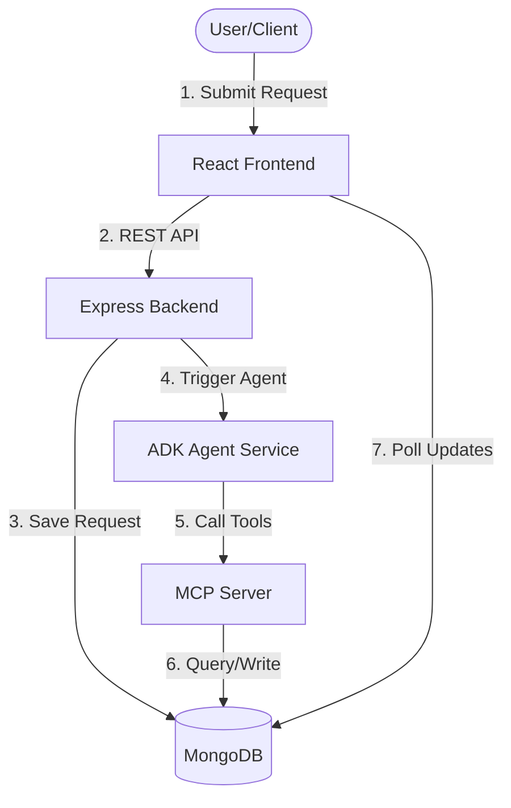
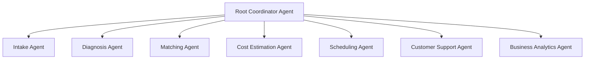

# FIXIT AI AGENT

> **"An AI-powered artisan matching and repair management platform for homes and businesses."**

[](https://www.kaggle.com)
[](https://adk.dev)
[](https://modelcontextprotocol.org)

FIXIT is a portfolio-quality, production-ready multi-agent platform designed for the **Kaggle AI Agents Capstone Project**. It connects homeowners and businesses in Cameroon with certified local artisans (plumbers, electricians, carpenters, AC technicians, etc.) while offering automated diagnostics, cost estimations, and conflict-free scheduling.

---

## 1. System Architecture

The platform is designed as a modular monorepo:
* **Frontend**: React + Tailwind CSS client dashboard with interactive AI support.
* **Backend Gateway**: Node.js + Express REST API coordinating auth, database schemas, and proxying agent sessions.
* **Database**: MongoDB Atlas storing profiles, estimates, appointments, reviews, and alerts.
* **AI Agent Service**: Python FastAPI service powered by Google ADK and Gemini.
* **MCP Server**: Stdio Model Context Protocol (MCP) server exposing database tools to the AI agents.

### Data Flow Diagram



---

## 2. Multi-Agent Architecture

The agent ecosystem is built using **Google ADK** (Agent Development Kit), orchestrating 7 specialized sub-agents:



1. **Intake Agent**: Parses descriptions, extracts symptoms, and requests clarifications.
2. **Diagnosis Agent**: Classifies repair category, urgency level, and diagnosis summary.
3. **Technician Matching Agent**: Performs proximity-based search to match nearby available technicians.
4. **Cost Estimation Agent**: Computes labor, parts, and travel estimates in FCFA.
5. **Scheduling Agent**: Proposes booking times and creates appointments.
6. **Customer Support Agent**: Answers questions about quotes, technician qualifications, and scheduling.
7. **Business Analytics Agent**: Provides reporting insights.

---

## 3. MCP Architecture & Tools

The agents utilize a custom **Model Context Protocol (MCP)** server over stdio to read/write real-time data:

* **Technician Tool**: `search_technicians`, `get_technician_profile`.
* **Pricing Tool**: `get_category_rates`, `create_estimate`.
* **Appointment Tool**: `create_appointment`.
* **Location Tool**: `calculate_proximity` (using coordinates).
* **Notification Tool**: `send_notification`.

---

## 4. Security Implementation

FIXIT integrates high-standard, open-source security libraries:
* **Authentication**: JWT token verification.
* **Security Headers**: Helmet integration.
* **Rate Limiting**: Express-rate-limit protecting REST endpoints.
* **Input Validation**: Sanitization and schemas using `express-validator`.
* **Prompt Injection Protection**: Sanitized prompts in the ADK agent system instructions.

---

## 5. Quick Start & Installation

To run the project on your local machine:

### Setup
1. Clone the repository and install all npm dependencies:
   ```bash
   npm install
   ```
2. Set up Python environment and sync dependencies:
   ```bash
   cd agent && uv sync && cd ..
   ```
3. Set your Google AI Studio Gemini API Key:
   ```bash
   export GOOGLE_API_KEY="your_gemini_api_key_here"
   ```
4. Seed the database with 50 technicians, 100 requests, and 200 reviews:
   ```bash
   npm run seed
   ```
5. Run the dev servers concurrently:
   ```bash
   npm run dev
   ```

* **React App**: `http://localhost:5173`
* **Express API**: `http://localhost:5000`
* **FastAPI Agent**: `http://localhost:8000`

---

## 6. Docker Compose

Run the entire environment including database inside Docker:
```bash
export GOOGLE_API_KEY="your_gemini_api_key"
docker-compose up --build
docker exec -it fixit-backend npm run seed
```

For more detailed setup, including Vercel and Render free-tier deployment guides, see the [Deployment & Setup Guide](file:///Users/ndansisigala/Documents/GitHub/Capstone/Deployment_Guide.md).
