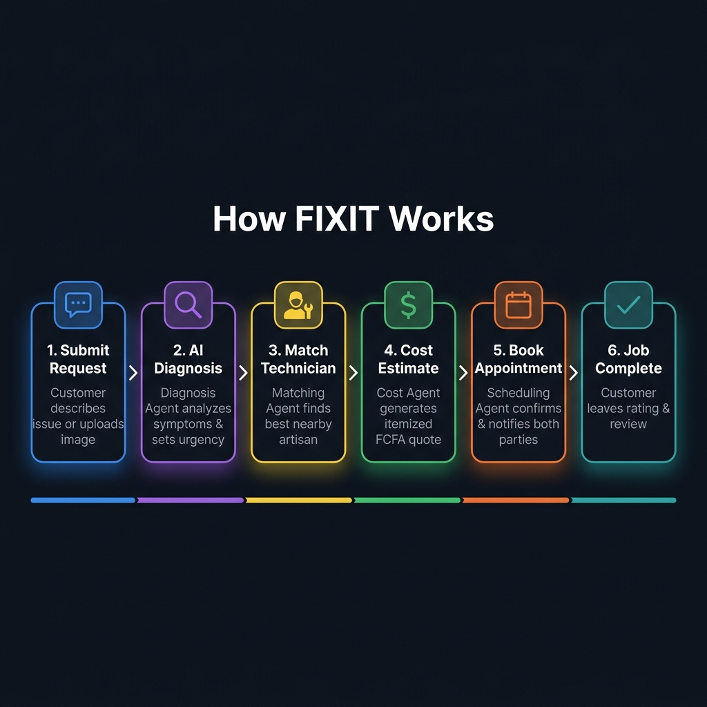
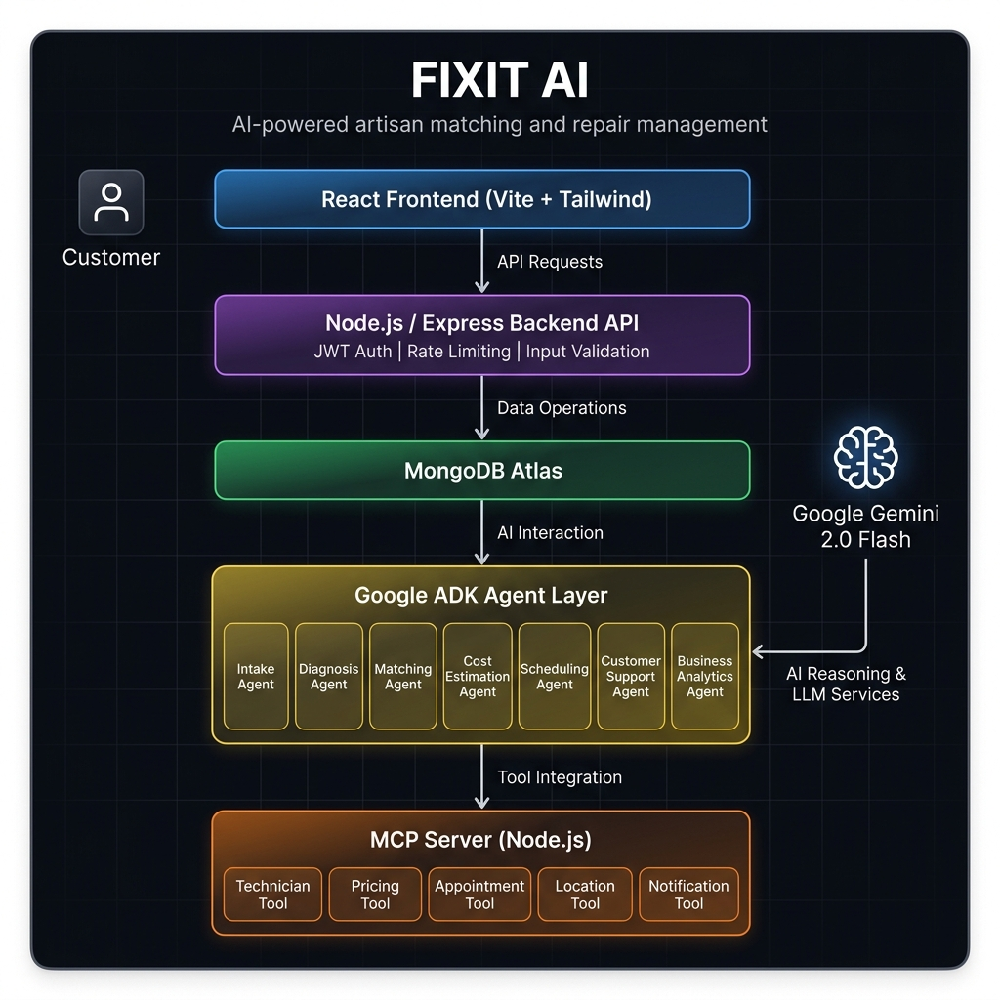
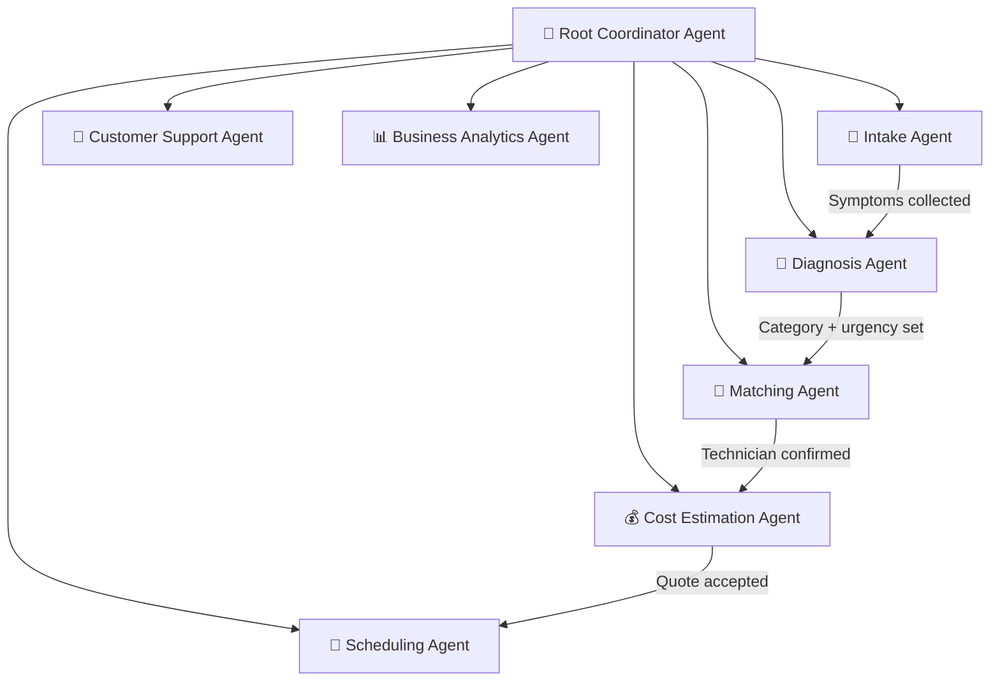

<div align="center">

# 🔧 FIXIT AI

### An AI-Powered Artisan Matching & Repair Management Platform

[](https://google.github.io/adk-docs/)
[](https://ai.google.dev/)
[](https://modelcontextprotocol.io/)
[](https://react.dev/)
[](https://www.mongodb.com/atlas)
[](LICENSE)

**FIXIT AI** connects customers in Cameroon with trusted, skilled artisans — powered by a multi-agent AI system that diagnoses issues, matches technicians, generates cost estimates, and books appointments automatically.

[Getting Started](#-getting-started) • [Architecture](#-architecture) • [Agents](#-multi-agent-system) • [API Reference](#-api-reference) • [Deployment](#-deployment)

</div>

---

## 📋 Table of Contents

- [The Problem](#-the-problem)
- [The Solution](#-the-solution)
- [How FIXIT Works](#-how-fixit-works)
- [Architecture](#-architecture)
- [Multi-Agent System](#-multi-agent-system)
- [MCP Server & Tools](#-mcp-server--tools)
- [Tech Stack](#-tech-stack)
- [Project Structure](#-project-structure)
- [Getting Started](#-getting-started)
- [API Reference](#-api-reference)
- [Security](#-security)
- [Deployment](#-deployment)
- [Contributing](#-contributing)
- [License](#-license)

---

## 🚨 The Problem

Customers in Cameroon and across Africa face persistent challenges finding reliable repair services:

| Challenge | Impact |
|-----------|--------|
| 🔍 **Finding skilled artisans** | Hours wasted searching through word-of-mouth referrals |
| 💰 **Unpredictable pricing** | No transparency leads to overcharging and disputes |
| 📅 **Scheduling chaos** | Double-bookings, no-shows, and endless phone calls |
| 🤷 **Describing issues** | Customers struggle to explain technical problems accurately |
| ⭐ **Trust deficit** | No verified reviews or quality guarantees |

---

## 💡 The Solution

FIXIT AI is an **intelligent repair management platform** that uses a coordinated team of 7 specialized AI agents to handle the entire repair lifecycle — from understanding what's broken to booking a certified technician at a fair price.

### Key Features

- 🗣️ **Natural Language Intake** — Describe your problem in plain English or French; the AI understands
- 🔬 **AI-Powered Diagnosis** — Automatic issue classification, urgency scoring, and category detection
- 📍 **Proximity-Based Matching** — Finds the best available technician near you using GPS coordinates
- 💵 **Transparent Estimates** — Itemized quotes in FCFA (labor, parts, travel) before you commit
- 📆 **Conflict-Free Scheduling** — Automated booking with double-booking prevention
- 🔔 **Real-Time Notifications** — In-app alerts for confirmations, reminders, and status updates
- 📊 **Business Analytics** — Operational dashboards for platform managers

---

## 🔄 How FIXIT Works

The platform guides every repair request through 6 intelligent stages:

<div align="center">
  
</div>

<br/>

| Step | Agent | What Happens |
|------|-------|-------------|
| **1. Submit Request** | Intake Agent | Customer describes the issue or uploads an image. The agent extracts symptoms and asks clarifying questions. |
| **2. AI Diagnosis** | Diagnosis Agent | Analyzes symptoms to determine the repair category (e.g., Plumbing, Electrical), urgency level, and confidence score. |
| **3. Match Technician** | Matching Agent | Searches for available artisans by skill, city, rating, experience, and proximity — recommends the best fit. |
| **4. Cost Estimate** | Cost Estimation Agent | Fetches baseline pricing, adjusts for severity, and generates an itemized FCFA quote. |
| **5. Book Appointment** | Scheduling Agent | Confirms date, time, and location. Creates the appointment and sends notifications to both parties. |
| **6. Job Complete** | Customer Support Agent | Handles post-service queries, reviews, and follow-up support. |

---

## 🏗️ Architecture

<div align="center">
  
</div>

<br/>

The system follows a layered architecture with clear separation of concerns:

```
┌──────────────────────────────────────────────────────────────┐
│                    CUSTOMER / ADMIN UI                        │
│               React + Vite + Tailwind CSS                    │
├──────────────────────────────────────────────────────────────┤
│                  BACKEND API GATEWAY                         │
│         Node.js + Express (JWT · Helmet · Rate Limit)        │
├──────────────────────────────────────────────────────────────┤
│                      DATA LAYER                              │
│                   MongoDB Atlas                              │
├──────────────────────────────────────────────────────────────┤
│                 AI AGENT LAYER (Google ADK)                   │
│  Intake · Diagnosis · Matching · Cost · Scheduling           │
│  Customer Support · Business Analytics                       │
│              ↕ Gemini 2.0 Flash (LLM)                        │
├──────────────────────────────────────────────────────────────┤
│               MCP SERVER (stdio transport)                   │
│  Technician Tool · Pricing Tool · Appointment Tool           │
│  Location Tool · Notification Tool                           │
└──────────────────────────────────────────────────────────────┘
```

---

## 🤖 Multi-Agent System

FIXIT uses the **Google Agent Development Kit (ADK)** to orchestrate 7 specialized sub-agents under a single root coordinator. All agents share access to MCP tools and are powered by **Gemini 2.0 Flash**.



| Agent | Responsibility | Key MCP Tools Used |
|-------|---------------|-------------------|
| **Intake Agent** | Collects issue descriptions, extracts symptoms, asks clarifying questions | — |
| **Diagnosis Agent** | Classifies repair category, sets urgency (Low/Medium/High), confidence score | — |
| **Matching Agent** | Finds best artisan by skill, rating, availability, and proximity | `search_technicians`, `calculate_proximity` |
| **Cost Estimation Agent** | Generates itemized FCFA quotes (labor + parts + travel) | `get_category_rates`, `create_estimate` |
| **Scheduling Agent** | Books appointments, prevents conflicts, confirms with both parties | `create_appointment`, `send_notification` |
| **Customer Support Agent** | Handles post-booking queries, complaints, and status lookups | — |
| **Business Analytics Agent** | Provides operational insights and reports for management | — |

---

## 🛠️ MCP Server & Tools

The **Model Context Protocol (MCP) Server** acts as the bridge between AI agents and the MongoDB database. It exposes 7 tools via stdio transport:

| Tool | Description |
|------|-------------|
| `search_technicians` | Find available technicians by skill category and city |
| `get_technician_profile` | Retrieve full profile + recent reviews for a technician |
| `get_category_rates` | Fetch baseline pricing (labor, parts, travel) for a repair category |
| `create_estimate` | Save an itemized price quote to the database |
| `calculate_proximity` | Calculate distance (km) between customer's city and technician (Haversine formula) |
| `create_appointment` | Schedule a confirmed booking between customer and technician |
| `send_notification` | Send in-app notifications (info, alert, reminder) |

---

## 🧰 Tech Stack

| Layer | Technology |
|-------|-----------|
| **Frontend** | React 18, Vite, Tailwind CSS, React Router, Lucide Icons |
| **Backend** | Node.js, Express, Mongoose, JWT, Helmet, express-rate-limit |
| **AI/Agents** | Google ADK (Agent Development Kit), Google Gemini 2.0 Flash |
| **Protocol** | Model Context Protocol (MCP) with stdio transport |
| **Database** | MongoDB Atlas (Free Tier) |
| **Auth** | JWT (JSON Web Tokens), bcrypt password hashing |
| **DevOps** | Docker, Docker Compose, Concurrently |
| **Deployment** | Vercel (Frontend), Render (Backend), Localhost |

---

## 📁 Project Structure

```
Fixit-AI/
├── frontend/                   # React + Vite + Tailwind UI
│   ├── src/
│   │   ├── components/         # Reusable UI components
│   │   ├── pages/              # Application pages
│   │   │   ├── LandingPage.jsx
│   │   │   ├── LoginPage.jsx
│   │   │   ├── RegistrationPage.jsx
│   │   │   ├── CustomerDashboard.jsx
│   │   │   ├── TechnicianDashboard.jsx
│   │   │   ├── AdminDashboard.jsx
│   │   │   ├── RepairRequestPage.jsx
│   │   │   ├── EstimatePage.jsx
│   │   │   ├── AppointmentPage.jsx
│   │   │   ├── AnalyticsDashboard.jsx
│   │   │   └── NotificationCenter.jsx
│   │   ├── App.jsx
│   │   └── main.jsx
│   └── package.json
│
├── backend/                    # Express API server
│   ├── models/                 # Mongoose schemas
│   │   ├── User.js
│   │   ├── Technician.js
│   │   ├── RepairRequest.js
│   │   ├── Estimate.js
│   │   ├── Appointment.js
│   │   ├── Review.js
│   │   └── Notification.js
│   ├── routes/                 # API route handlers
│   │   ├── auth.js             # Register, login, JWT
│   │   ├── technicians.js      # Technician CRUD + search
│   │   ├── requests.js         # Repair request management
│   │   ├── estimates.js        # Cost estimate endpoints
│   │   ├── appointments.js     # Booking management
│   │   ├── analytics.js        # Business analytics
│   │   └── notifications.js    # In-app notifications
│   ├── middleware/              # Auth & validation middleware
│   ├── scripts/
│   │   └── seed.js             # Database seeding script
│   └── server.js               # Express app entry point
│
├── agent/                      # Google ADK multi-agent system
│   ├── app/
│   │   ├── agent.py            # All 7 agents + root coordinator
│   │   ├── fast_api_app.py     # FastAPI wrapper for the ADK app
│   │   └── app_utils/          # Agent utilities
│   ├── tests/                  # Agent tests
│   ├── pyproject.toml          # Python dependencies (uv)
│   └── Dockerfile
│
├── mcp_server/                 # Model Context Protocol server
│   └── server.js               # 7 MCP tools (stdio transport)
│
├── docker/                     # Dockerfiles
│   ├── backend.Dockerfile
│   ├── frontend.Dockerfile
│   └── agent.Dockerfile
│
├── docs/                       # Documentation images
│   ├── architecture.png
│   └── workflow.png
│
├── docker-compose.yml          # Full-stack orchestration
├── package.json                # Root monorepo scripts
└── README.md
```

---

## 🚀 Getting Started

### Prerequisites

| Tool | Version | Purpose |
|------|---------|---------|
| **Node.js** | >= 18 | Backend + Frontend + MCP Server |
| **Python** | >= 3.11 | Google ADK agent runtime |
| **uv** | latest | Python package manager |
| **MongoDB** | >= 7 | Database (local or Atlas) |
| **Docker** | >= 24 | Optional containerized deployment |

### 1. Clone the Repository

```bash
git clone https://github.com/sigala000/Fixit-AI.git
cd Fixit-AI
```

### 2. Get a Google Gemini API Key (Free)

1. Go to [Google AI Studio](https://aistudio.google.com/apikey)
2. Click **"Create API Key"**
3. Copy your key

### 3. Set Up Environment Variables

**Agent** (`agent/.env`):

```env
GOOGLE_API_KEY=your_gemini_api_key_here
GOOGLE_GENAI_USE_VERTEXAI=False
MONGODB_URI=mongodb://localhost:27017/fixit
```

**Backend** (`backend/.env`):

```env
MONGODB_URI=mongodb://localhost:27017/fixit
JWT_SECRET=your_jwt_secret_here
PORT=5000
```

**MCP Server** (`mcp_server/.env`):

```env
MONGODB_URI=mongodb://localhost:27017/fixit
```

### 4. Install Dependencies

```bash
# Install all Node.js dependencies (backend + frontend + mcp_server)
npm install

# Install Python agent dependencies
cd agent
uv sync
cd ..
```

### 5. Seed the Database

```bash
npm run seed
```

This populates MongoDB with **50+ technicians**, **100+ repair requests**, **200+ reviews**, and sample data across 8 Cameroonian cities.

### 6. Run the Platform

**Option A — All services at once (recommended):**

```bash
npm run dev
```

**Option B — Run services individually:**

```bash
# Terminal 1: Backend API
npm run dev:backend        # → http://localhost:5000

# Terminal 2: Frontend UI
npm run dev:frontend       # → http://localhost:5173

# Terminal 3: Agent Service
npm run dev:agent          # → http://localhost:8000
```

**Option C — Docker Compose:**

```bash
docker compose up --build
```

---

## 📡 API Reference

Base URL: `http://localhost:5000/api`

### Authentication

| Method | Endpoint | Description |
|--------|----------|-------------|
| `POST` | `/auth/register` | Register a new user (customer/technician) |
| `POST` | `/auth/login` | Authenticate and receive JWT token |

### Technicians

| Method | Endpoint | Description |
|--------|----------|-------------|
| `GET` | `/technicians` | List all technicians |
| `GET` | `/technicians/:id` | Get technician profile + reviews |
| `GET` | `/technicians/search?category=&city=` | Search by skill and location |

### Repair Requests

| Method | Endpoint | Description |
|--------|----------|-------------|
| `POST` | `/requests` | Submit a new repair request |
| `GET` | `/requests` | List requests (filtered by user role) |
| `GET` | `/requests/:id` | Get request details |
| `PATCH` | `/requests/:id` | Update request status |

### Estimates

| Method | Endpoint | Description |
|--------|----------|-------------|
| `GET` | `/estimates` | List cost estimates |
| `POST` | `/estimates` | Create a new estimate |

### Appointments

| Method | Endpoint | Description |
|--------|----------|-------------|
| `GET` | `/appointments` | List appointments |
| `POST` | `/appointments` | Book an appointment |
| `PATCH` | `/appointments/:id` | Update appointment status |

### Analytics

| Method | Endpoint | Description |
|--------|----------|-------------|
| `GET` | `/analytics` | Get operational analytics (admin) |

### Notifications

| Method | Endpoint | Description |
|--------|----------|-------------|
| `GET` | `/notifications` | Get user notifications |

> **Note:** All endpoints except auth require a valid JWT token in the `Authorization: Bearer <token>` header.

---

## 🔒 Security

| Feature | Implementation |
|---------|---------------|
| **Authentication** | JWT tokens with configurable expiry |
| **Password Security** | bcrypt hashing with salt rounds |
| **HTTP Security** | Helmet.js (CSP, HSTS, XSS protection) |
| **Rate Limiting** | 100 requests per 15 minutes per IP |
| **Input Validation** | express-validator on all API inputs |
| **Role-Based Access** | Customer, Technician, and Admin roles |
| **Prompt Injection Protection** | Structured agent instructions with scoped permissions |
| **Secrets Management** | Environment variables via `.env` files (never committed) |

---

## 🌍 Deployment

### Frontend → Vercel (Free)

```bash
cd frontend
npx vercel --prod
```

### Backend → Render (Free)

1. Push to GitHub
2. Connect repo on [render.com](https://render.com)
3. Set build command: `npm install`
4. Set start command: `node server.js`
5. Add environment variables in Render dashboard

### Docker (Full Stack)

```bash
docker compose up --build -d
```

| Service | Port | URL |
|---------|------|-----|
| Frontend | 80 | `http://localhost` |
| Backend | 5000 | `http://localhost:5000` |
| Agent | 8000 | `http://localhost:8000` |
| MongoDB | 27017 | `mongodb://localhost:27017/fixit` |

---

## 🏙️ Supported Cities

FIXIT currently operates across **8 cities in Cameroon**:

> Douala · Yaoundé · Bafoussam · Kribi · Limbe · Garoua · Bamenda · Bertoua

---

## 👷 Artisan Categories

| Category | Example Services |
|----------|-----------------|
| ⚡ Electricians | Wiring, outlets, circuit breakers |
| 🔧 Plumbers | Pipes, faucets, water heaters |
| 🪚 Carpenters | Doors, furniture, shelving |
| 🔩 Welders | Gates, railings, metal repairs |
| ☀️ Solar Technicians | Panel installation, inverters |
| ❄️ AC Technicians | Air conditioner repair, installation |
| 🧊 Refrigeration Technicians | Fridges, freezers, cold rooms |
| 🎨 Painters | Interior/exterior painting |
| 🧱 Masons | Tiling, plastering, concrete |
| 🔌 Appliance Repair Specialists | Washing machines, ovens, TVs |

---

## 🤝 Contributing

Contributions are welcome! Please follow these steps:

1. Fork the repository
2. Create a feature branch: `git checkout -b feature/amazing-feature`
3. Commit your changes: `git commit -m 'Add amazing feature'`
4. Push to the branch: `git push origin feature/amazing-feature`
5. Open a Pull Request

---

## 📄 License

This project is licensed under the MIT License — see the [LICENSE](LICENSE) file for details.

---

<div align="center">

**Built with ❤️ for Cameroon 🇨🇲**

*FIXIT AI — Connecting communities with trusted artisans through the power of AI*

</div>